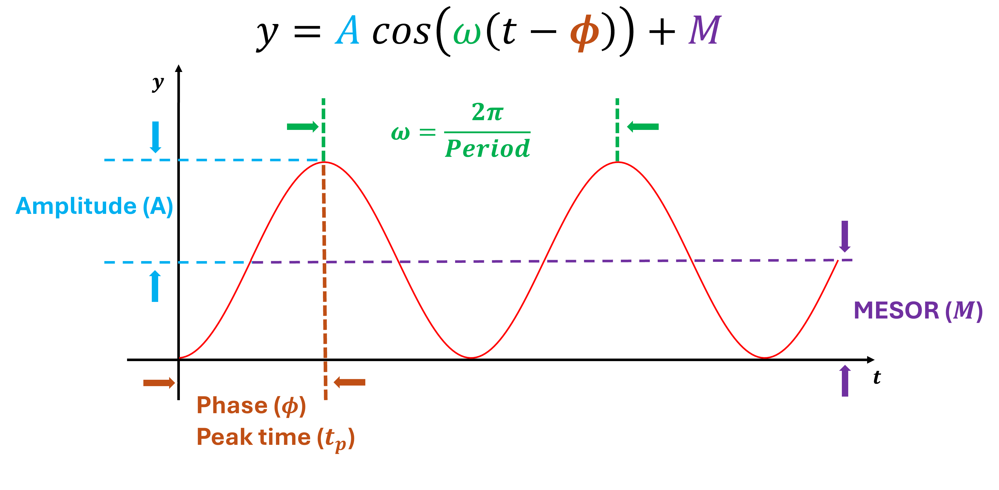
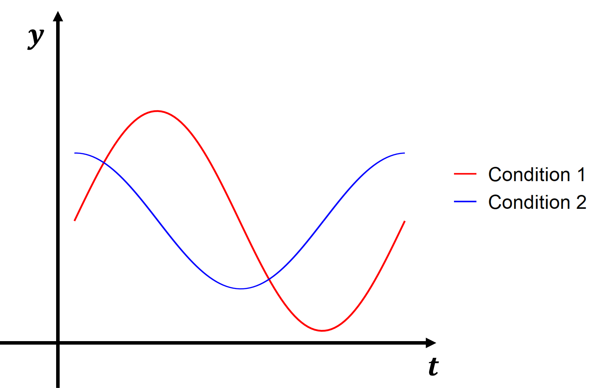
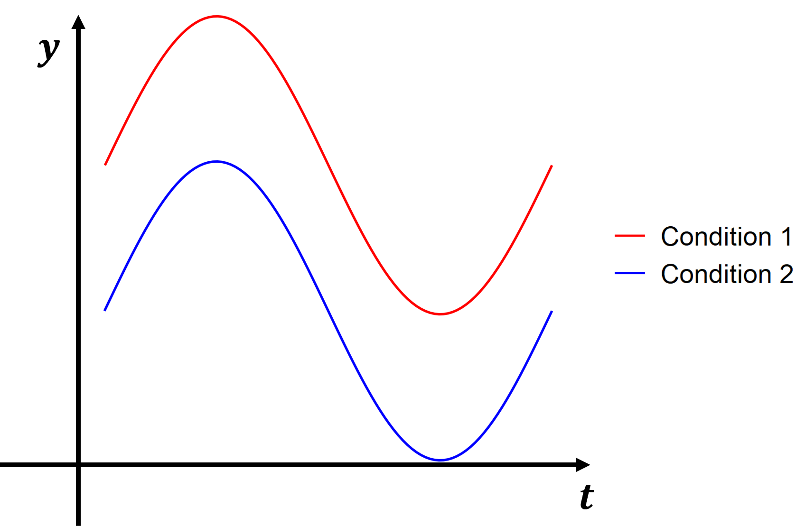

```{r, include = FALSE}
knitr::opts_chunk$set(
  collapse = TRUE,
  comment = "#>"
)

options(stringsAsFactors = FALSE)
```

# Introduction

## Background
Differential circadian pattern refers to the variation in circadian rhythmicity across different conditions, such as between health and disease states, different tissues, or varying environmental contexts. The Bayesian approach (BayesDCirc) excels in statistical power and reliability for detecting differential circadian biomarkers. It can incorporate prior knowledge and provides a framework for estimating uncertainty in predictions or parameter evaluations, which is invaluable for understanding the variability and robustness of circadian biomarkers.





## Terminologies

Denote:

* $y$ as the expression value for a gene. 

* $t$ as the circadian time. 

* $M$ as the MESOR (Midline Estimating Statistic of Rhythm).

* $A$ as the amplitude. 

* $\omega$ is the frequency of the cosinusoidal wave, where $\omega = \frac{2\pi}{Period}$. 


Without loss of generality, we set $Period = 24$ hours to mimic the diurnal period. 
$\phi$ is the phase of the cosinusoidal wave curve. Since $\phi$ is difficult to read from a cosinusoidal wave, we denote the peak time $t_P$ as a closely related quantify. The connection between $\phi$ and $t_P$ is that $\phi + t_P = 12 \pm 24N$, where $N$ is an arbitrary natural number.


## Differential Circadian Detection

Denote $y_{1i}$ as the gene expression value of subject $i (1\le i \le n_1)$ in experimental condition 1, 
where $n_1$ is the total number of subjects; $t_{1i}$ is the circadian time for subject $i$.
$y_{2j}$ is the gene expression value of subject $j (1\le j \le n_2)$ in experimental condition 2, 
where $n_2$ is the total number of subjects; $t_{2j}$ is the circadian time for subject $j$.
Note that $y_{1i}$ and $y_{2j}$ are from the same gene, but under different experimental conditions.
We assume the following models:
\begin{equation}
  \label{eq:diffCircadian}
  \begin{aligned}
    y_{1i} &= A_1\cos(\omega(t_{1i}+\phi_1))+M_1+\varepsilon_{1i} \\
    y_{2j} &= A_2\cos(\omega(t_{2j}+\phi_2))+M_2+\varepsilon_{2j}
  \end{aligned}
\end{equation}
\noindent $\varepsilon_{1i} \sim \textit{N}(0,\sigma_1^2)$ is the error term for subject $i$ ($1\le i \le n_1$) for experimental condition 1 and 
$\varepsilon_{2j} \sim \textit{N}(0,\sigma_2^2)$ is the error term for subject $j$ ($1\le j \le n_2$) for experimental condition 2. 
These error terms are assumed to be $iid$.
$A_1$, $\phi_1$, $M_1$, and $\sigma_1^2$ are the amplitude, phase, MESOR, and noise level for the experimental condition 1, and
$A_2$, $\phi_2$, $C_2$, and $\sigma_2^2$ are for experimental condition 2. 

Based on these formulations, we will examine the following 2 types of differential circadian patterns.

 

* Figure above shows shape change, where $A$ or $\phi$ is different between two conditions.



* Figure above shows MESOR change, where $M$ is different between two conditions.


Below we state the null hypothesis and the alternative hypothesis for testing these two categories of differential circadian patterns.

(1) Differential shape: $H_0: A_1 = A_2 \quad\text{and}\quad \phi_1 = \phi_2$ v.s. $H_A: A_1 \neq A_2 \quad\text{or}\quad \phi_1 \neq \phi_2$. 

(2) Differential MESOR: $H_0: M_1 = M_2$ v.s. $H_A: M_1 \neq M_2$.


## About this tutorial
This is a tutorial for the usage of "BayesDCirc" package. A real data example of aging on circadian patterns of gene expression in the mouse skeletal muscle tissue is used. The major contents of this tutorial include: 

- How to prepare input for BayesDCirc.

- Detection of differential circadian patterns.

- Visualizing differential circadian patterns' curves.

# About the package

## How to install the package

To install this package, start R (version "2.10" or higher) and enter: 
  
```{r, eval=FALSE}
library(devtools)
devtools::install_github("lichen-lab/BayesDCirc")
```

## How to cite the package
TAB

## Maintainer
Yutao Zhang (zhangyutao@ufl.edu)

## Description about the example data

In the mouse multi-tissue transcriptomic data, tissues from the hypothalamus, lung, kidney, skeletal muscle, heart, and adrenal gland of young (6 months), aged (18 months), and old (27 months) male mice were collected every 4 hours over a 48-hour period to characterize circadian transcriptome changes with age. This RNA-seq dataset is publicly available on GEO (GSE201207). We will focus on detecting genes of differential circadian patterns in the skeletal muscle as the example.

The data preprocess includes: (1) applied counts per million (CPM) normalization and took the log-transform; (2) filtering out genes with mean CPM less than 1; (3) identified circadian genes in young group and old group using "diffCircadian" R package (pvalue < 0.05).

## Read in the example data
```{r}
library(BayesDCirc) # include BayesDCirc package
# load the data
data("exp_young_muscle")
data("exp_old_muscle")
data("pheno_young_muscle")
data("pheno_old_muscle")

```

# Differential Circadian Pattern Detection

## Data preparation for differential circadian analysis
We first loaded datasets based on two age groups: young group and old group. We will then perform differential circadian analysis comparing young and old groups.

```{r}
Y1 <- exp_young_muscle
Y2 <- exp_old_muscle
t1 <- pheno_young_muscle$time
t2 <- pheno_old_muscle$time
```

We recommend to perform circadian rhythmicity detection in two comparison groups, respectively, to facilitate further differential circadian analysis. The loaded example data is already performed, so there is no need to run circadian analysis if you are using the example data. You are welcome to use "diffCircadian" R package to perform circadian analysis for your own data.

```{r}
## circadian analysis in one example group (young)
## Please note that you don't need to run this circadian analysis if you are using example data (mouse muscle data)
if(F){
    library(tidyverse)
    library(diffCircadian)
    # circadian analysis in groups
    exp <- exp_young_muscle
    tt <- pheno_young_muscle$time
    thisResult <- data.frame(genes = rownames(exp), 
                             amp =NA, phase = NA, peakTime = NA, basal = NA, pvalue = NA
    )
    
    for(gg in 1:nrow(thisResult)){
      if(gg %% 1000 == 0){
        cat('processed', gg, 'genes\n')
      }
      yy <- as.numeric(exp[gg, ]) ## make sure yy is a numeric vector instead of dataframe. 
      aLR <- LR_rhythmicity(tt, yy)
      
      thisResult$amp[gg] <- aLR$amp
      thisResult$phase[gg] <- aLR$phase
      thisResult$peakTime[gg] <- aLR$peakTime
      thisResult$basal[gg] <- aLR$offset
      thisResult$pvalue[gg] <- aLR$pvalue
    }
    
    head(thisResult)
}

```


## Differential shape and MESOR

**Get hyperparameters for BayesDCirc**
```{r}
# Get hyperparameters
hyperparameters <- get_hyperparameters(Y1,Y2,t1,t2, use_default = T)
hyperparameters
```

**Perform BayesDCirc using gibbs sampling**

```{r}
# process gibbs sampling
set.seed(123)
output <- BayesDCirc(Y1 = Y1,Y2 = Y2, t1 = t1, t2 = t2, n.iter= 10000, hyperparameters = hyperparameters, showIteration = F)

```

**Evaluate differential shape**

```{r}
# evaluate the result by FDR
result_shape_diff <- BayesianFDR(output, indicator = "I")
result_diff_shape_sorted <- result_shape_diff[order(result_shape_diff$FDR), ]
head(result_diff_shape_sorted)
```

**Evaluate differential MESOR**

```{r}
# evaluate the result by FDR
result_MESOR_diff <- BayesianFDR(output, indicator = "L")
result_diff_MESOR_sorted <- result_MESOR_diff[order(result_MESOR_diff$FDR), ]
head(result_diff_MESOR_sorted)
```

**Save the result**

```{r, eval = FALSE}
write.csv(result_diff_shape_sorted, file = "result_diff_shape_sorted.csv", row.names = FALSE)
write.csv(result_diff_MESOR_sorted, file = "result_diff_MESOR_sorted.csv", row.names = FALSE)

# the posterior values are stored in output variable (the output of BayesDCirc), which are helpful to visualize the differential pattern, so you can also save it if needed.
save(output, file = "output.rdata")

```

**Visualize the most significant gene**

```{r fig1, fig.height = 4, fig.width = 10}
# for visualization purpose
tt_base <- seq(16,64,1)
Curve <- function(t, E, F, M){
  X = cos((t*pi)/12)
  Z = sin((t*pi)/12)
  E*X + F*Z + M
}

# plot the top 1 shape change gene
topGene_diff <- result_diff_shape_sorted$gene_candidates[1]
byy_young <- as.numeric(exp_young_muscle[rownames(exp_young_muscle) %in% topGene_diff, ])
ind <- which(rownames(exp_young_muscle) == topGene_diff)
byy_young_fit <- Curve(tt_base, output$E1[ind],output$F1[ind], output$M1[ind])
  
byy_old <- as.numeric(exp_old_muscle[rownames(exp_old_muscle) %in% topGene_diff, ])
byy_old_fit <- Curve(tt_base, output$E2[ind],output$F2[ind], output$M2[ind])
  
ymax <- max(c(byy_young, byy_old))
ymin <- min(c(byy_young, byy_old))
  
title_young <- "young group"
title_old <- "old group"
ylab <- paste0(topGene_diff," Expression Value")
par(mfrow = c(1,2),mar = c(4, 4.5, 2, 1))
plot(t1, byy_young, xlab = "Hours (h)", ylab=ylab, main = title_young, ylim = c(ymin, ymax), pch=20, cex.axis = 2, cex.lab = 2,cex.main = 2)
lines(tt_base, byy_young_fit, col = 2, lwd =3)
plot(t2, byy_old , xlab = "Hours (h)", ylab=ylab, main = title_old, ylim = c(ymin, ymax), pch=20, cex.axis = 2, cex.lab = 2,cex.main = 2)
lines(tt_base, byy_old_fit, col = 4, lwd =3)

# plot the top 1 MESOR change gene
topGene_diff <- result_diff_MESOR_sorted$gene_candidates[1]
byy_young <- as.numeric(exp_young_muscle[rownames(exp_young_muscle) %in% topGene_diff, ])
ind <- which(rownames(exp_young_muscle) == topGene_diff)
byy_young_fit <- Curve(tt_base, output$E1[ind],output$F1[ind], output$M1[ind])
  
byy_old <- as.numeric(exp_old_muscle[rownames(exp_old_muscle) %in% topGene_diff, ])
byy_old_fit <- Curve(tt_base, output$E2[ind],output$F2[ind], output$M2[ind])
  
ymax <- max(c(byy_young, byy_old))
ymin <- min(c(byy_young, byy_old))
  
title_young <- "young group"
title_old <- "old group"
ylab <- paste0(topGene_diff," Expression Value")
par(mfrow = c(1,2),mar = c(4, 4.5, 2, 1))
plot(t1, byy_young, xlab = "Hours (h)", ylab=ylab, main = title_young, ylim = c(ymin, ymax), pch=20, cex.axis = 2, cex.lab = 2,cex.main = 2)
lines(tt_base, byy_young_fit, col = 2, lwd =3)
plot(t2, byy_old , xlab = "Hours (h)", ylab=ylab, main = title_old, ylim = c(ymin, ymax), pch=20, cex.axis = 2, cex.lab = 2,cex.main = 2)
lines(tt_base, byy_old_fit, col = 4, lwd =3)

```

```{r}
sessionInfo()
```

